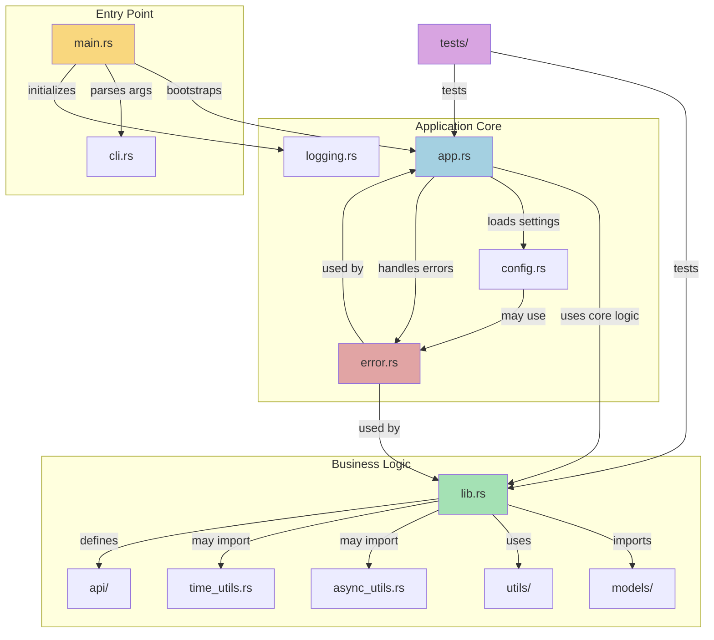

# Architecture Overview

This document outlines the architectural approach used in this project template. The structure follows modern Rust best practices with a focus on modularity, separation of concerns, and maintainability.
It is designed to scale, starting simple and have a clean organization that can be grown if the project requires it.

## Rust File Structure Guide

| File           | Development Use Case                                    | When to Use                                      | Key Components                                       |
|----------------|--------------------------------------------------------|--------------------------------------------------|-----------------------------------------------------|
| `lib.rs`       | Shared business logic, core functionality              | Creating reusable components, library crates      | Public API, modules exports, domain logic, unit tests |
| `main.rs`      | Application entry point                                | Creating executable programs                      | Minimal bootstrap code, error handling, CLI parsing   |
| `app.rs`       | Application state and coordination                     | When you need central application management      | `App` struct, application lifecycle methods          |
| `cli.rs`       | Command-line interface                                 | When accepting user input via command line        | `Args` struct with `clap` attributes                 |
| `config.rs`    | Configuration management                               | When app needs configurable settings              | Config loading, validation, environment integration  |
| `error.rs`     | Custom error handling                                  | When standard errors aren't sufficient            | Error enums with `thiserror`, custom error messages  |
| `logging.rs`   | Logging and tracing setup                              | Production applications that need observability   | Logging initialization, log level configuration      |
| `async_utils.rs` | Asynchronous operations                              | Applications with I/O or concurrency needs       | Async functions, Tokio integration                   |
| `time_utils.rs` | Date and time handling                                | Applications that work with timestamps            | Temporal calculations, formatting, parsing           |
| `models/`      | Data structures and database models                    | Applications with complex data representations    | Domain entities, database mappings, validations      |
| `api/`         | API endpoints and handlers                             | Web services and API-driven applications          | Route definitions, request/response handlers         |
| `utils/`       | Miscellaneous helper functions                         | Common utilities needed across the application    | Helper functions, extension traits                   |
| `tests/`       | Integration and end-to-end tests                       | Testing across module boundaries                  | Test fixtures, integration tests, benchmarks         |



## Tests structure

```
scaffold-rs/template/
├── src/
│   └── lib.rs           (with unit tests, doc tests)
├── tests/
│   ├── common/
│   │   └── mod.rs       (shared test utilities, setup/teardown)
│   ├── integration_tests.rs (test public API)
│   └── test_with_setup.rs
└── Cargo.toml           (with dev-dependencies)
```
